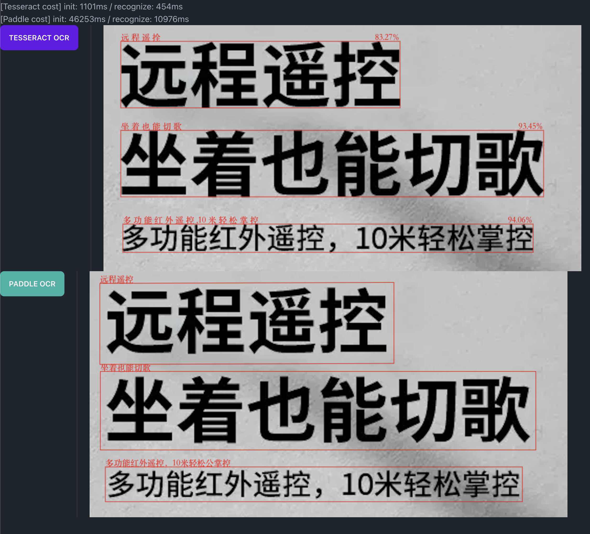

# ocr sample

| 方案 | 生态 | 模型是否支持本地化 | 初始化速度 | 中文识别准确度 | 识别速度 |
| - | - | - | - | - | - |
| Tesserect.js | 一般 | 是 | 快 | 低 | 快 |
| Paddle.js | 上次更新在2022年 | 是 | 慢 | **高** | 一般 |

---

1. 模型大小

Tesseract.js 的  模型大小约为 20 MB, 而 Paddle.js 的模型大小约为 14 MB.

两者都保留了接口以支持自定义模型路径

2. 初始化速度

Tesseract.js 的初始化速度相对较快，可以快速加载模型并开始进行 OCR 识别。Paddle.js 的初始化速度相对较慢，需要比较长的时间来加载并初始化模型，所用的测试机器（MacBook Pro 2019 13-inch）加载时间接近 `1min`

⚠️ 注意： 不确定 `Paddle.js` 是否支持使用 worker，以避免阻塞页面交互

3. 文字识别准确度

在 OCR 文字识别中文的准确度方面，Paddle.js 的表现相对较好。Paddle.js 的模型采用了深度学习技术，可以更好地适应不同的语言和字体，从而提高识别准确度。

而 Tesseract.js 的模型相对简单，准确度方面表现一般。

📒 如何提高 Tesseract 模型识别准确度：[maybe 可以参考这个](https://blog.csdn.net/tiantian1980/article/details/123896573)

---

## 效果比较

1. 默认配置，无优化

